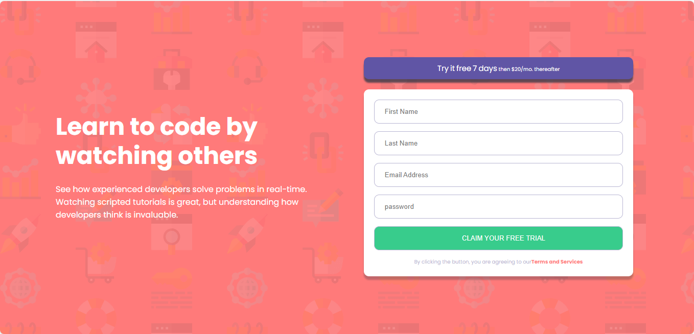
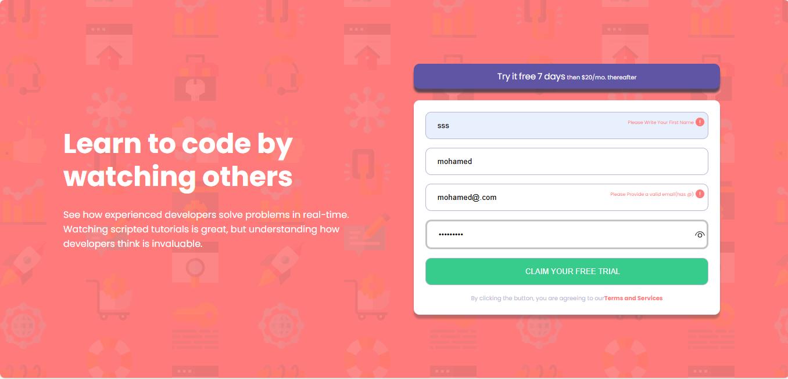

# Frontend Mentor - Intro component with sign-up form

This is a solution to the [Intro component with sign-up form](https://www.frontendmentor.io/challenges/intro-component-with-signup-form-5cf91bd49edda32581d28fd1). Frontend Mentor challenges help you improve your coding skills by building realistic projects.

## Table of contents

- [Overview](#overview)
  - [The challenge](#the-challenge)
  - [Screenshot](#screenshot)
  - [Links](#links)
  - [Installation](#Installation)
  - [Usage](#Usage)
- [My process](#my-process)
  - [Built with](#built-with)
  - [What I learned](#what-i-learned)
  - [Continued development](#continued-development)
- [Author](#author)
- [Acknowledgments](#Acknowledgments)

## Overview

### The challenge

Practice building out a sign-up form complete with client-side validation using JavaScript.

Your users should be able to:

- View the optimal layout for the interface depending on their device's screen size
- See hover and focus states for all interactive elements on the page
- Receive an error message when the form is submitted if:
- Any input field is empty
- The email address is not formatted correctly

### Screenshot




### Links

- Solution URL: [here](https://github.com/olahasan/HTML_CSS_AND_J.S_Frontend-Mentor_NEWBIE-Intro-component-with-sign-up-form)

- Live Site URL: [here](https://olahasan.github.io/HTML_CSS_AND_J.S_Frontend-Mentor_NEWBIE-Intro-component-with-sign-up-form/)

## Installation

To get a local copy up and running, follow these simple steps:

1. **Clone the repository**:

   ```sh
   git clone https://github.com/your-username/your-repo-name.git
   ```

2. **Navigate to the project directory**:

   ```sh
   cd your-repo-name
   ```

3. **Open the project in your preferred code editor**.

## Usage

To use the components in your project, you can simply copy the HTML, CSS, and JavaScript files into your project directory. Make sure to link the CSS and JS files correctly in your HTML.

## My process

### Built with

- Semantic HTML5 markup
- CSS custom properties
- Flexbox
- JavaScript for form validation
- Mobile-first workflow

### What I Learned

In this project, I practiced using Flexbox for layout and CSS custom properties for better maintainability. I also focused on practiceing basic form validation.

### Continued Development

I plan to continue improving my skills in html,css and javascript

### Author

Frontend Mentor - @olahasan<br>
GitHub - @olahasan

### Acknowledgments

I would like to thank the **Frontend Mentor** for providing this challenge and to the community for their support and feedback
